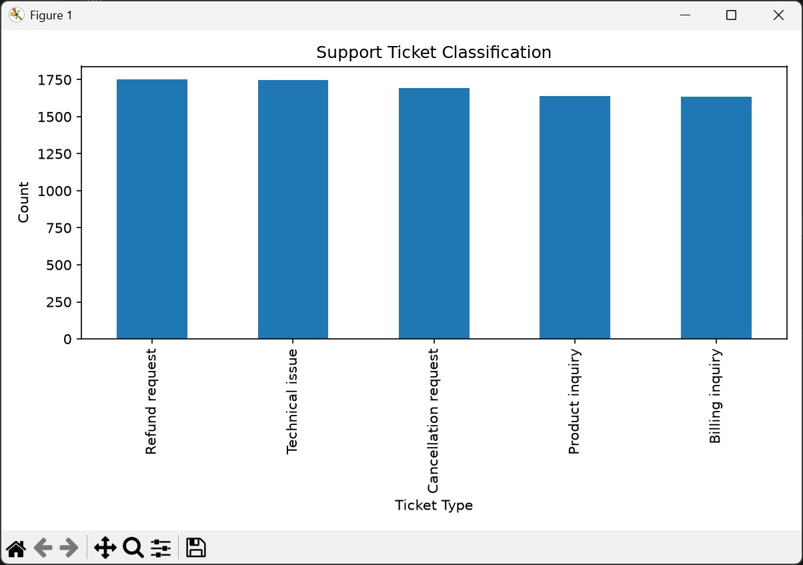

# 🚀 Support Ticket Classification System (NLP)

---
## 📌 Overview

This project builds a Natural Language Processing (NLP) based system to automatically classify customer support tickets into different categories.

The model analyzes ticket text and predicts the appropriate support category, helping organizations improve customer service efficiency.

---

## 🎯 Problem Statement

Customer support teams receive thousands of tickets every day.

Manually categorizing these tickets is:

- Time-consuming
- Error-prone
- Inefficient

This project automates ticket classification using NLP and Machine Learning techniques.

---

## ⚙️ Features

✅ Text Cleaning & Preprocessing

✅ Tokenization

✅ Ticket Category Classification

✅ Model Performance Evaluation

✅ Visualization using Matplotlib

---

## 🛠️ Tech Stack

- Python
- Pandas
- NumPy
- NLTK
- Scikit-Learn
- Matplotlib

---

## 📂 Project Structure

.png.jpg)

✅ Conclusion

This project demonstrates how NLP and Machine Learning can automate customer support ticket classification.
The system improves efficiency, reduces manual effort, and helps support teams handle tickets faster and more accurately.
